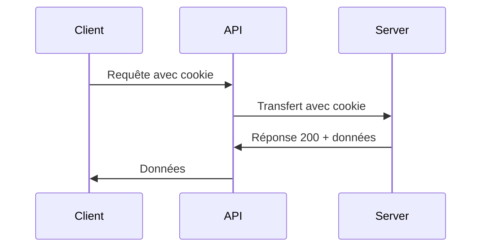
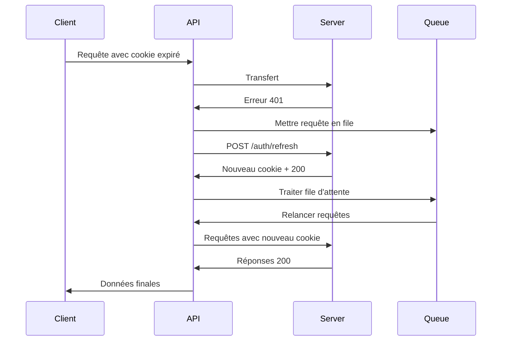

# Configuration API

La configuration API centralise toutes les interactions avec le backend de Smart Legal Contract, incluant l'authentification, la gestion des erreurs et le refresh automatique des tokens.

## 🎯 Vue d'ensemble

Le fichier `api.config.js` configure une instance Axios centralisée avec :
- **Authentification par cookies HTTP-only**
- **Gestion automatique des erreurs 401**
- **Refresh automatique des tokens**
- **File d'attente des requêtes pendant le refresh**

## 📋 Configuration de base

```javascript
// services/api.config.js
import axios from 'axios';
import router from '@/router';
import {API_BASE_URL} from '@/config/config';

// Création de l'instance Axios
const apiClient = axios.create({
  baseURL: API_BASE_URL,
  withCredentials: true, // IMPORTANT: Permet l'envoi et la réception de cookies HTTP-only
  headers: {
    'Content-Type': 'application/json',
    'Accept': 'application/json'
  }
});
```

### Points clés de la configuration

- **`baseURL`** : URL de base définie dans la configuration
- **`withCredentials: true`** : Crucial pour les cookies HTTP-only
- **Headers standards** : JSON par défaut pour toutes les requêtes

## 🔑 Gestion des clés API

### Intercepteur de requêtes

```javascript
// Ajout automatique de l'en-tête X-API-KEY
apiClient.interceptors.request.use(
  config => {
    // Ajouter la clé API à chaque requête
    config.headers['X-API-KEY'] = import.meta.env.VITE_API_KEY || 'pk_master_admin';
    
    // Pas besoin d'ajouter manuellement le token d'authentification
    // Les cookies HTTP-only sont automatiquement envoyés par le navigateur
    
    return config;
  },
  error => {
    // En cas d'erreur lors de la préparation de la requête
    console.error('Erreur de préparation de la requête:', error);
    return Promise.reject(error);
  }
);
```

### Configuration environnement

```bash
# .env
VITE_API_KEY=pk_master_admin
```

## 🔄 Refresh automatique des tokens

### Variables de gestion

```javascript
// Variables pour gérer la file d'attente des requêtes
let isRefreshing = false;
let failedQueue = [];

// Liste des chemins qui ne nécessitent pas de rafraîchissement de token
const noNeedToRefresh = [
  '/auth/login',
  '/auth/register',
  '/auth/refresh',
];
```

### Traitement de la file d'attente

```javascript
/**
 * Traite la file d'attente des requêtes ayant échoué
 * @param {Error} error - L'erreur à rejeter si le rafraîchissement a échoué
 * @param {boolean} success - Indique si le rafraîchissement a réussi
 */
function processQueue(error, success = false) {
  failedQueue.forEach(p => {
    if (error) {
      p.reject(error);
    } else {
      p.resolve();
    }
  });
  failedQueue = [];
}
```

## 🛡️ Intercepteur de réponses

### Gestion des erreurs 401

```javascript
// Intercepteur pour gérer les erreurs et le rafraîchissement des tokens
apiClient.interceptors.response.use(
  // Pour les réponses réussies, simplement passer les données
  response => response,
  
  // Pour les erreurs, tenter de rafraîchir le token si nécessaire
  async error => {
    const originalRequest = error.config;
    
    // Si c'est une erreur 401 et que ce n'est pas une demande d'authentification
    if (
      error.response?.status === 401 &&
      !noNeedToRefresh.some(path => originalRequest.url.includes(path)) &&
      !originalRequest._retry
    ) {
      originalRequest._retry = true;
      
      // Si un rafraîchissement est déjà en cours, mettre la requête en file d'attente
      if (isRefreshing) {
        return new Promise((resolve, reject) => {
          failedQueue.push({ resolve, reject });
        }).then(() => apiClient(originalRequest));
      }
      
      isRefreshing = true;
      
      try {
        // Tenter de rafraîchir le token via les cookies HTTP-only
        await apiClient.post('/auth/refresh');
        
        // Le cookie est automatiquement mis à jour par le serveur
        processQueue(null, true);
        
        // Réexécuter la requête originale maintenant que le cookie est rafraîchi
        return apiClient(originalRequest);
      } catch (refreshError) {
        // Si le rafraîchissement échoue, déconnecter l'utilisateur
        processQueue(refreshError);
        
        // Rediriger vers la page de connexion
        router.push({ 
          name: 'login',
          query: { redirect: router.currentRoute.value.fullPath }
        });
        
        return Promise.reject(refreshError);
      } finally {
        isRefreshing = false;
      }
    }
    
    // Pour les autres erreurs, les laisser passer pour être traitées par les services
    return Promise.reject(error);
  }
);
```

## 🔄 Flux de gestion des tokens

### Scénario normal


### Scénario avec refresh


## 🚨 Gestion des erreurs

### Types d'erreurs gérées

1. **401 Unauthorized** : Refresh automatique
2. **403 Forbidden** : Redirection vers login
3. **Network errors** : Propagation vers les services
4. **Refresh failure** : Déconnexion forcée

### Chemins exclus du refresh

Les endpoints suivants ne déclenchent pas de refresh automatique :
- `/auth/login` - Connexion initiale
- `/auth/register` - Inscription
- `/auth/refresh` - Refresh lui-même

## 🔧 Configuration côté serveur requise

### Headers CORS
```javascript
// Configuration serveur Express/FastAPI
{
  credentials: true,
  origin: ['http://localhost:3000'],
  allowedHeaders: [
    'Content-Type', 
    'Accept', 
    'X-API-KEY'
  ],
  methods: ['GET', 'POST', 'PUT', 'DELETE', 'PATCH']
}
```

### Cookies sécurisés
```javascript
// Configuration des cookies côté serveur
{
  httpOnly: true,      // Inaccessible via JS
  secure: false,       // true en production HTTPS
  sameSite: 'lax',     // Protection CSRF
  maxAge: 3600000      // 1 heure
}
```

## 📱 Utilisation dans les services

Tous les services importent cette configuration :

```javascript
// services/authService.js
import apiClient from './api.config';

const AuthService = {
  async login(email, password) {
    // apiClient gère automatiquement les headers et cookies
    const response = await apiClient.post('/auth/login', { email, password });
    return response.data;
  }
};
```

## 🧪 Tests et debugging

### Logs de debugging
```javascript
// Ajouter des logs pour le debugging
apiClient.interceptors.request.use(config => {
  console.log('🚀 Requête:', config.method.toUpperCase(), config.url);
  return config;
});

apiClient.interceptors.response.use(
  response => {
    console.log('✅ Réponse:', response.status, response.config.url);
    return response;
  },
  error => {
    console.log('❌ Erreur:', error.response?.status, error.config?.url);
    return Promise.reject(error);
  }
);
```

### Monitoring de la file d'attente
```javascript
// Surveiller la file d'attente pendant le développement
const monitorQueue = () => {
  console.log('📋 File d\'attente:', {
    isRefreshing,
    queueLength: failedQueue.length,
    pendingRequests: failedQueue.map(p => p.config?.url)
  });
};
```

## ⚡ Optimisations

### Retry automatique
Pour améliorer la robustesse, on peut ajouter un retry automatique :

```javascript
const retryRequest = async (config, maxRetries = 3) => {
  for (let i = 0; i < maxRetries; i++) {
    try {
      return await apiClient(config);
    } catch (error) {
      if (i === maxRetries - 1 || error.response?.status !== 500) {
        throw error;
      }
      await new Promise(resolve => setTimeout(resolve, 1000 * (i + 1)));
    }
  }
};
```

### Cache des requêtes
```javascript
const cache = new Map();

apiClient.interceptors.request.use(config => {
  if (config.method === 'GET') {
    const cached = cache.get(config.url);
    if (cached && Date.now() - cached.timestamp < 60000) {
      return Promise.resolve(cached.response);
    }
  }
  return config;
});
```
